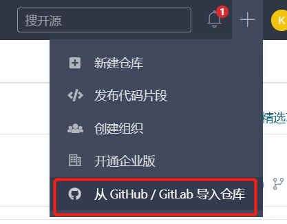
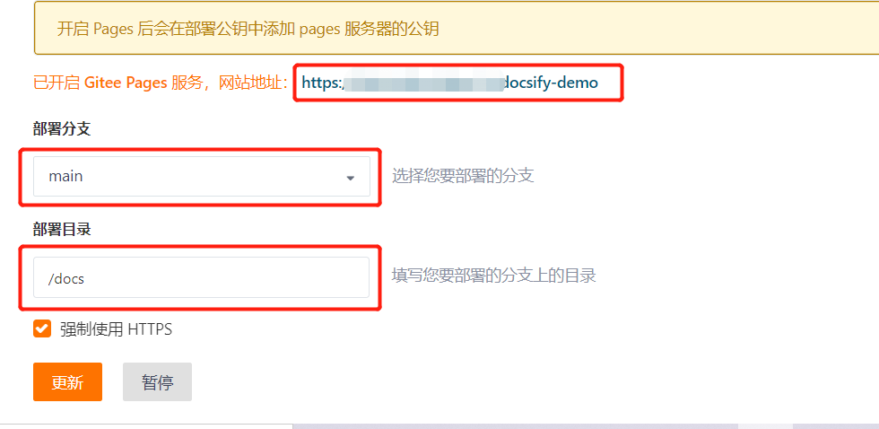

------

***官方文档***：https://docsify.js.org/#/zh-cn/quickstart

# 使用docsify搭建文档网站

## 1 前置条件

   - 已有GitHub账号

   - 已安装NPM，并且全局安装 `docsify-cli` 工具，可以方便地创建及在本地预览生成的文档

         npm i docsify-cli -g

## 2 创建项目

   - 创建新文件夹（docsify-demo）

   - 在`docsify-demo`文件夹下使用init初始化项目，创建项目名为docs（官方推荐）的项目

         docsify init ./docs
    
## 3 启动项目

   - 使用`docsify serve`启动项目，访问`http://localhost:3000`浏览页面
   
         docsify serve docs
    
## 4 部署到GitHub

   - 在GitHub上新建仓库
   
   - 上传项目
   
   - 在GitHub中进入项目，打开Setting页面，在当前页面找到`GitHub Pages`模块，如下图设置
   

   - 设置好GitHub后，点击保存，等待一下将会显示浏览地址，访问浏览地址即可进入网站
   
## 5 同步到Gitee

   - 登录到Gitee账户后，点击右上角的加号，其中有一个`从GitHub/GitLab导入仓库`选项，点击该选项进入导入仓库页面。
   

   
   - 进入新页面后，可以点击`导入GitHub仓库`标签，可以在标签下查看到所有关联GitHub账户上的仓库，点击导入按钮，等待即可。
   

## 6 部署到Gitee

   - 进入到仓库中，点击`服务`按钮，选中其中`Gitee Pages`选项。
   

   - 选择部署分支及部署目录，点击更新按钮即可完成部署。部署完成后将会显示网站地址。
   
