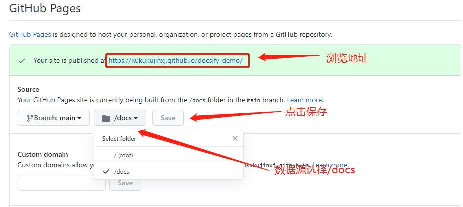

------

***官方文档***：https://docsify.js.org/#/zh-cn/quickstart

# 使用docsify搭建文档网站

## 1 前置条件

   - 已有GitHub账号

   - 已安装NPM，并且全局安装 `docsify-cli` 工具，可以方便地创建及在本地预览生成的文档

         npm i docsify-cli -g

## 2 创建项目

   - 创建新文件夹（docsify-demo）

   - 在`docsify-demo`文件夹下使用init初始化项目，创建项目名为docs（官方推荐）的项目

         docsify init ./docs
    
## 3 启动项目

   - 使用`docsify serve`启动项目，访问`http://localhost:3000`浏览页面
   
         docsify serve docs
    
## 4 部署

   - 在GitHub上新建仓库
   
   - 上传项目
   
   - 在GitHub中进入项目，打开Setting页面，在当前页面找到`GitHub Pages`模块，如下图设置
   

   - 设置好GitHub后，点击保存，等待一下将会显示浏览地址，访问浏览地址即可进入网站