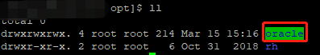
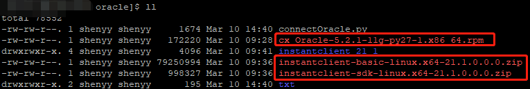
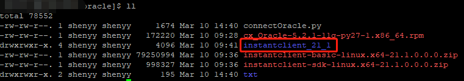

------

# Linux离线安装cx_Oracle

## 1 背景

在一次开发过程中，我们需要客户数据作为测试数据，但是又不可以直接访问客户数据库，因此希望使用脚本取出指定数据。在线下载cx_Oracle模块时，总是提示无法访问指定地址，因此改用离线安装。

## 2 准备安装包

安装包版本请按照python和Oracle版本自行选择，此次选用如下版本：

* [cx_Oracle-5.2.1-11g-py27-1.x86_64.rpm](https://pypi.org/project/cx-Oracle/5.2.1/#files)
* [instantclient-basic-linux.x64-21.1.0.0.0.zip](https://www.oracle.com/database/technologies/instant-client/linux-x86-64-downloads.html)
* [instantclient-sdk-linux.x64-21.1.0.0.0.zip](https://www.oracle.com/database/technologies/instant-client/linux-x86-64-downloads.html)

## 3 安装Oracle客户端

在/opt目录下新建oracle目录，并将安装包都放在此文件夹下：

    cd /opt
    mkdir oracle
    
注：若权限不够可以在命令前面加`sudo`关键字，或者使用`su -root`命令切换到root账号，或者使用`chomd 777`命令设置文件操作权限（可读可写可执行）。

解压instantclient-basic-linux和instantclient-sdk-linux安装包，生成instantclient_21_1文件夹。

    unzip instantclient-sdk-linux.x64-21.1.0.0.0.zip
    unzip instantclient-basic-linux.x64-21.1.0.0.0.zip

配置环境变量

    vim /etc/profile
    

使环境变量生效

    source /etc/profile
    
## 4 安装cx_Oracle

安装
    
    rpm -hvi cx_Oracle-5.2.1-11g-py27-1.x86_64.rpm
    
测试，使用此命令且不报错

    python -c "import cx_Oracle"

## 5 脚本代码

    #!/usr/bin/python2.7
    # -*- coding: utf-8 -*-
    
    import os
    
    import cx_Oracle
    
    os.environ['NLS_LANG'] = 'SIMPLIFIED CHINESE_CHINA.UTF8'
    
    
    def export(connect, table):
        conn = cx_Oracle.connect(connect, encoding="UTF-8", nencoding="UTF-8")
        c = conn.cursor()
        with open('/opt/oracle/txt/{}.txt'.format(table), 'w') as f:
            x = c.execute('select * from {}'.format(table))
            arr = []
            for row in x:
                cols = []
                for col in row:
                    if col:
                        cols.append('\'' + col.decode('utf-8') + '\'')
                    else:
                        cols.append('')
                s = '({})'.format(','.join(cols))
                arr.append(s)
            s = 'insert into {0} values {1};'.format(table, ','.join(arr))
            f.write(s)
        c.close()
        conn.close()
    
    export('username/password@host:port/servicename', 'tablename')
    
## 6 参考

* https://cx-oracle.readthedocs.io/en/latest/user_guide/installation.html
* https://blog.csdn.net/qq_36743482/article/details/80884190