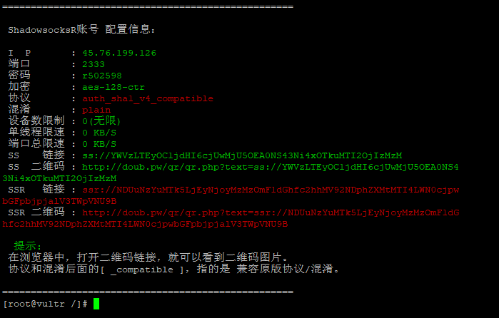

------

# 搭建SSR

## 1 执行命令

   wget -N --no-check-certificate https://raw.githubusercontent.com/ToyoDAdoubi/doubi/master/ssr.sh && chmod +x ssr.sh && bash ssr.sh
   
## 2 客户端

   地址：https://my.oschina.net/u/3743915/blog/1586615

### 2.1 Windows

   地址一：https://github.com/shadowsocks/shadowsocks-windows/releases
   
   地址二：https://github.com/shadowsocks/shadowsocks-qt5/releases
        
### 2.2 Mac OS X

   地址：https://github.com/shadowsocks/ShadowsocksX-NG/releases
   
### 2.3 linux

   地址一：https://github.com/shadowsocks/shadowsocks-qt5/wiki/Installation
   
   地址二：https://github.com/shadowsocks/shadowsocks-qt5/releases
        
### 2.4 iOS

   地址一：https://itunes.apple.com/app/apple-store/id1070901416?pt=2305194&ct=shadowsocks.org&mt=8
   
   地址二：https://github.com/shadowsocks/shadowsocks-iOS/releases
        
### 2.5 Android

   地址一：https://play.google.com/store/apps/details?id=com.github.shadowsocks
   
   地址二：https://github.com/shadowsocks/shadowsocks-android/releases
        
## 3 图示

   
