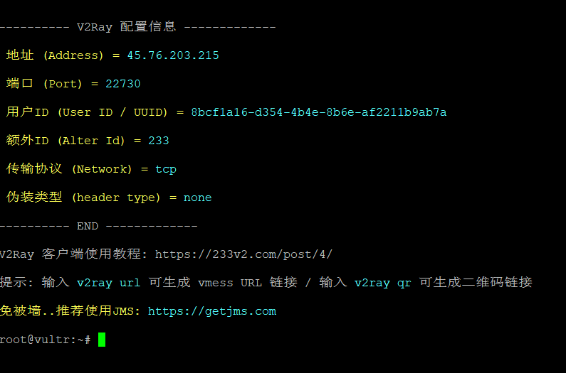

------

# 搭建V2Ray

## 1 执行命令

   bash <(curl -s -L https://git.io/v2ray.sh)
    
## 2 搭建教程

   地址：https://yangwenqing.com/archives/487/
   
## 3 客户端

   地址：https://strangechannel188.wixsite.com/website/single-post/2019/03/30/Windows%E7%8E%AF%E5%A2%83%E4%B8%8BV2Ray-%E5%AE%A2%E6%88%B7%E7%AB%AF
   
## 4 图示

   