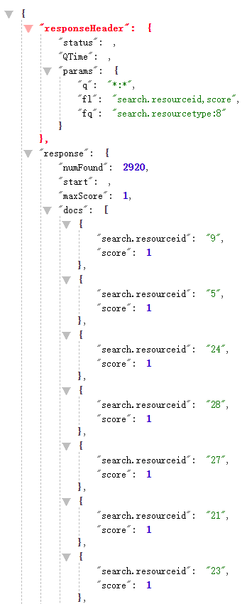
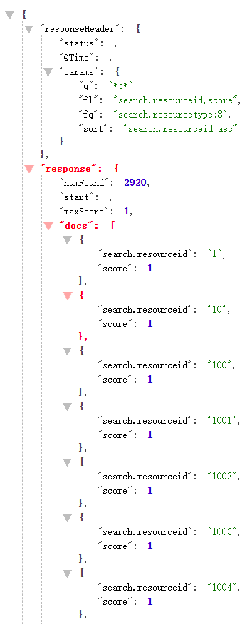
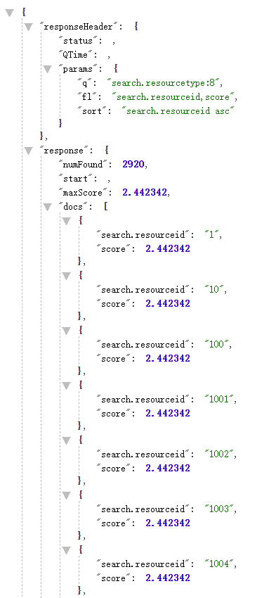
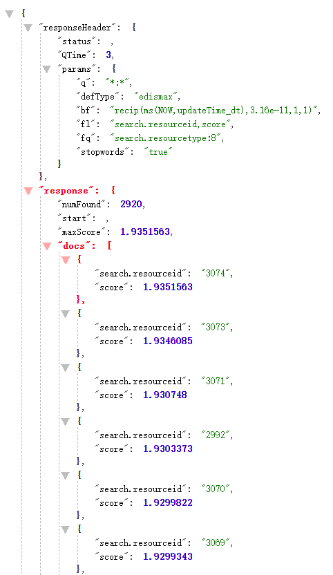
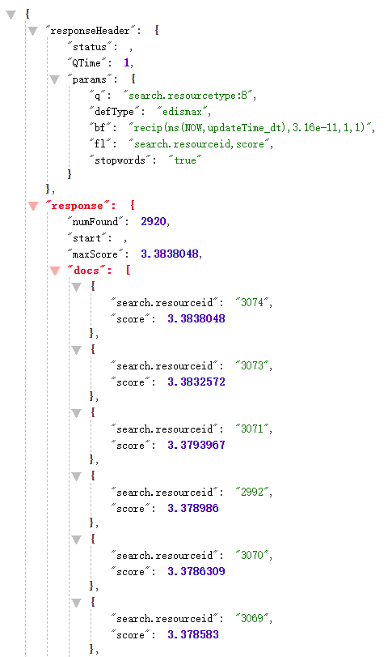

------

# 相似度排序

## 1 什么是相似度排序

Solr在进行关键词查询时，默认TF-IDF算法来计算关键词和文档的相关度，用相关度进行排序。得分越高，排序越靠前。

## 2 指定/不指定排序

当不指定排序规则时，默认是以文档的相关度为排序标准。相当于加上参数`sort=score desc`,其中`score`是Solr的隐藏字段，即为相似度。

当指定按某字段升序排序时，如`sort=filed asc`，默认先以文档相关度排序，再以该字段排序。相当于加上参数`sort=score desc, filed asc`。

有时候，排序规则可能会按照两个filed值做算数运算。如，排序基于两个字段的和，可以使用查询参数`sort=sum(filed1, filed2) desc`。

## 3 q和fq查询参数对于结果的影响

如上图所示，查询时会发现score值均为1，这个值是怎么来的呢？是因为查询时返回了所有数据`q=*:*`，他们权重都相同。这边就不得不提到q和fq作为查询参数的区别了。

如果使用q作为查询参数，将会查询到所有符合条件的数据，然后order by score，这时就会按照字段的相似度来排序。

如果使用fq作为查询参数，并且`q=*:*`，那么将会先order by score，而且因为条件是`q=*:*`,所以所有文档的相关度相同，再使用fq过滤数据，将会出现相关度都为1的情况。

综上所述，以相关度score为优先排序条件时，参数一定要放在q中。

## 4 Lucene的打分模型

如何计算文档相关度呢？默认使用Lucene打分模型：**TF/IDF(term frequency/inverse document frequecy)** 算法。

**概念公式：**

$$ score(q,d) = coord\text{--}factor(q,d) * query\text{--}boost(q) * \frac{V(q) * V(d)}{|V(q)|} * doc\text{--}len\text{--}norm(d) * doc\text{--}boost(d) $$ 

V(d)归一化为单位向量没有考虑Field Length属性，同时Field Lenth会影响相似度得分，因此不能单纯的将V(d)归一化为单位矢量，于是引入了一个新的文档长度归一化因子：`doc-len-norm`。

**实际公式：**

$$ score(q,d) = coord(q,d) * queryNorm(q) * \displaystyle\sum_{\text{t in q}} (tf(\text{t in d}) * idf(t)^2 * t.getBoost() * norm(t,d)) $$

**TF（Term frequency）：**

$$ tf(t_d) = \sqrt{\smash[b]{frequency}} $$

**IDF（Inverse document frequency）：**

$$ idf(t) = 1 + log(\frac{numDocs}{docFreq + 1}) $$

**Field-length norm：**

$$ norm(d) = 1 / \sqrt{\smash[b]{numTerms}} $$

**公式各影响因素解释：**

* 文档权重(Document boost)：在索引时给某个文档设置的权重值。
* 域权重(Field boost)：在查询的时候给某个域设置的权重值。
* 调整因子(Coord)：基于文档中包含查询关键词个数计算出来的调整因子。一般而言，如果一个文档中相比其它的文档出现了更多的查询关键词，那么其值越大。
* 逆文档频率(Inerse document frequency)：基于Term的一个因子，存在的意义是告诉打分公式一个词的稀有程度。其值越低，词越稀有(这里的值是指单纯的频率，即多少个文档中出现了该词；而非指Lucene中idf的计算公式)。打分公式利用这个因子提升包含稀有词文档的权重。
* 长度归一化(Length norm):基于域的一个归一化因子。其值由给定域中Term的个数决定(在索引文档的时候已经计算出来了，并且存储到了索引中)。域越的文本越长，因子的权重越低。这表明Lucene打分公式偏向于域包含Term少的文档。
* 词频(Term frequency)：基于Term的一个因子。用来描述给定Term在一个文档中出现的次数，词频越大，文档的得分越大。
* 查询归一化因子(Query norm)：基于查询语句的归一化因子。其值为查询语句中每一个查询词权重的平方和。查询归一化因子使得比较不同查询语句的得分变得可行，当然比较不同查询语句得分并不总是那么易于实现和可行的。

## 5 Boost和Sort

* 通过改变Boost值改变排序结果：

>+ Boost是指索引建立过程中，给整篇文档或者文档的某一特定属性设定的权值因子，在检索时，优先返回分数高的。通过Document对象的setBoost()方法和Field对象的setBoost()方法，可以分别为Document和Field指定Boost参数。不同在于前者对文档中每一个域都修改了参数，而后者只针对指定域进行修改。默认值为1F，一般不做修改。

>+ 图中bf公式为**1/(ms(NOW-updateTime)\*3.16e-11)+1**，ms()为两时间的毫秒差。公式中：更新时间与NOW相差越大，分数越小；分数在0-1之内；最近的更新时间和最远的更新时间对分数影响斜度不会太大。
>+ 

* 使用Sort对象定制排序：

>+ Sort支持的排序功能以文档当中的域为单位，通过这种方法，可以实现一个或者多个不同域的多形式的值排序。

## 6 结论

综上所述，Lucene的打分模型大致包含两个规则：

* 某个词或短语在一篇文章中出现的次数越多，越相关。
* 整个文档集合中包含某个词的文档数量越少，这个词越重要。

## 7 参考

* https://www.cnblogs.com/philo-x/p/11280313.html
* https://www.cnblogs.com/bonelee/p/6472922.html
* https://blog.csdn.net/qq_33301113/article/details/79200791
* https://my.oschina.net/passerman/blog/710141
* https://www.cnblogs.com/lvfeilong/p/wer42343.html